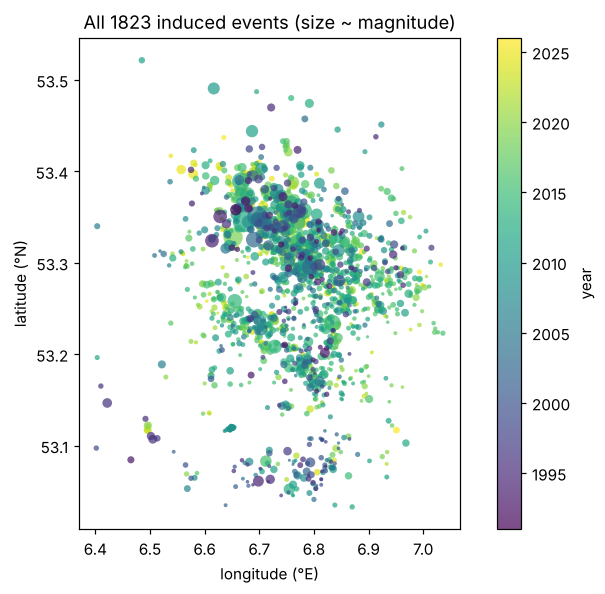
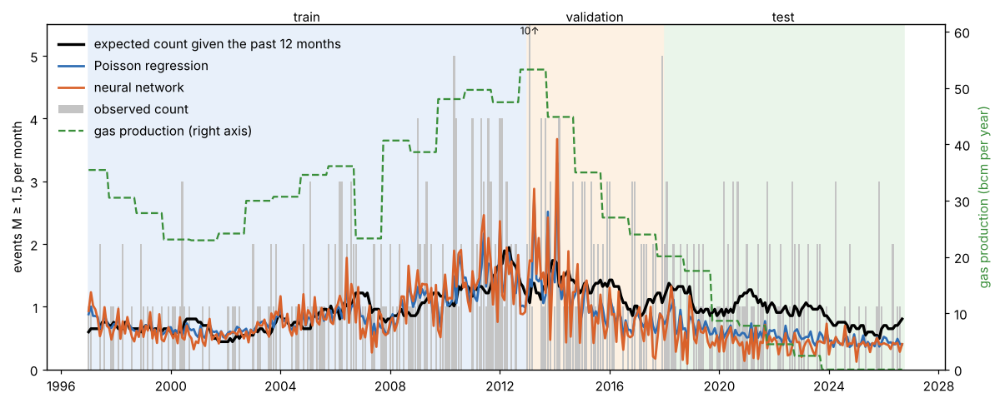
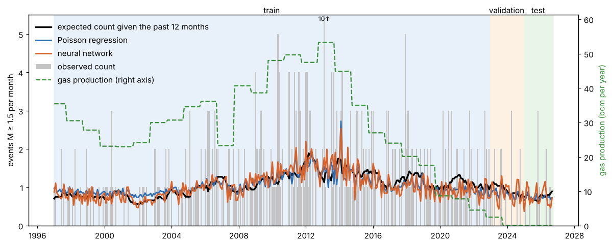
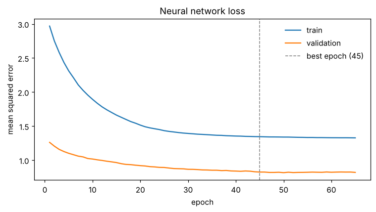

# Forecasting earthquakes in Groningen

Gas production from the Groningen field caused thousands of small earthquakes. This project forecasts how many M ≥ 1.5 earthquakes will happen next month, using past earthquake counts and gas production. It compares a neural network with Poisson regression and a simple baseline.



## Data

- `data/knmi_groningen_events.txt`: KNMI earthquake catalogue for 53.0–53.6 N, 6.4–7.3 E, 1991–2026, from the [KNMI FDSN service](https://rdsa.knmi.nl/fdsnws/event/1/query?format=text&starttime=1986-01-01&endtime=2026-10-08&minlatitude=53.0&maxlatitude=53.6&minlongitude=6.4&maxlongitude=7.3&nodata=404).
- `data/groningen_production_gasyear.csv`: Groningen production per gas year (October–September), from [dashboardgroningen.nl](https://www.dashboardgroningen.nl/gaswinning). Values are in thousands of Nm³. Only yearly totals are available, so each year is spread evenly over its months.

## Method

For each month the inputs are:

- the earthquake counts of the previous 12 months
- gas production over the past 12 months
- the change in production from the year before

The target is that month's count.

Three forecasts:

- **Baseline (black line)**: a straight line from the past 12-month average to next month's count.
- **Poisson regression**
- **Neural network**: one hidden layer of 8 ReLU nodes, trained epoch by epoch, stopping when the validation loss stops improving.

## Earthquakes continue after production stops

| period | gas production | M ≥ 1.5 earthquakes per month |
|---|---|---|
| 1996–2002 | 29 bcm/year | 0.44 |
| 2010–2013 | 49 bcm/year | 1.77 |
| 2014–2017 | 31 bcm/year | 1.42 |
| 2018–2022 | 11 bcm/year | 1.12 |
| Oct 2023 – Sep 2026 | 0 | 0.50 |

Production was cut by about 80% between 2013 and 2022, but the earthquake rate only fell by about a third. Since production stopped in October 2023 there have still been 18 events of M ≥ 1.5, including an M3.4 near Zeerijp in November 2025. Production and earthquakes are not simply proportional. The pressure in the reservoir keeps evening out for years after the wells close, so the rocks keep compacting and faults keep slipping.

This matters for training. A model only learns the situations it has seen.

### Training up to 2012

Train 1996–2012, validate 2013–2017, test 2018–2026.



All training years had high production (23–53 bcm/year). The models learned "less production means fewer earthquakes" and, in the test years, predicted about 0.4 events per month, while the real rate was about 1.1 until 2022 and 0.5 after production stopped. They had never seen a field with low production that was still active.

| | train | validation | test |
|---|---|---|---|
| baseline | 1.08 | 3.07 | **0.92** |
| Poisson regression | 0.96 | 3.13 | 1.03 |
| neural network | 0.84 | 3.25 | 1.12 |

(mean squared error, lower is better)

Here production makes the forecasts worse than ignoring it.

### Training up to 2022

Train 1996–2022, validate 2023–2024, test 2025–2026.



Now the training data includes the years of production cuts, where the rate fell slowly. The models no longer collapse when production drops, and they follow the black line in the validation and test years.

| | train | validation | test |
|---|---|---|---|
| baseline | 1.44 | 0.92 | 0.73 |
| Poisson regression | 1.39 | **0.81** | **0.70** |
| neural network | 1.35 | 0.83 | 0.82 |

Poisson regression is now slightly better than the baseline. The test period is only 21 months, though, so a difference of 0.03 is not enough to say it is really better.



### What this shows

- The training period has to include the conditions you want to forecast. Trained on the high-production years only, the models fail when production stops.
- Monthly counts are mostly chance. With about 1 event per month, an error of about 1 is the floor even for a perfect forecast, so all models end up close to each other.
- The neural network never clearly beats Poisson regression or the baseline. With about 300 noisy months there is not enough data for it to learn more than a simple rule.
- Yearly production is a rough input. Monthly data and reservoir pressure would describe the physics better.

## Running it

```bash
pip install -r requirements.txt
python run.py        # prints the loss per epoch and the scores, shows 3 figures
python -m pytest     # tests
```

All settings are at the top of `run.py`. Change `TRAIN_END` and `VAL_END` to try other splits.

```
run.py            settings and main steps
quakes/data.py    loading the data, building inputs and target, train/val/test split
quakes/models.py  baseline, Poisson regression, neural network
quakes/plots.py   the three figures
tests/            a few checks (counts, no future data in inputs, production units, early stopping)
```

## Note

I used Claude (Anthropic) as an assistant for parts of the code and this README.
